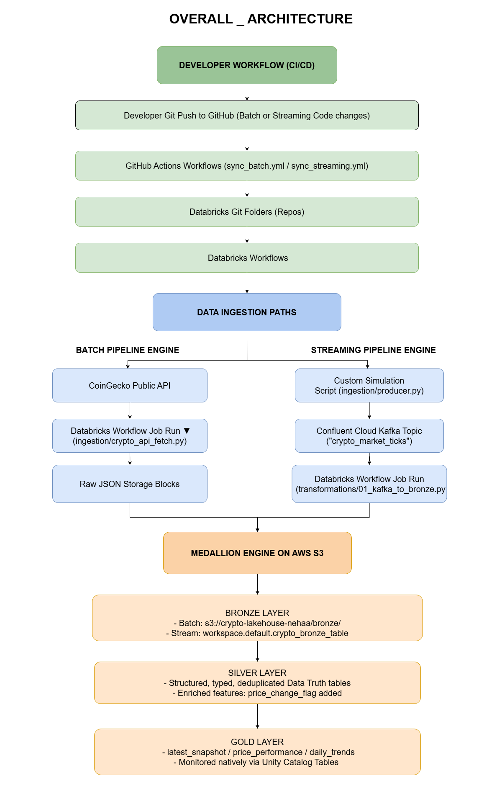
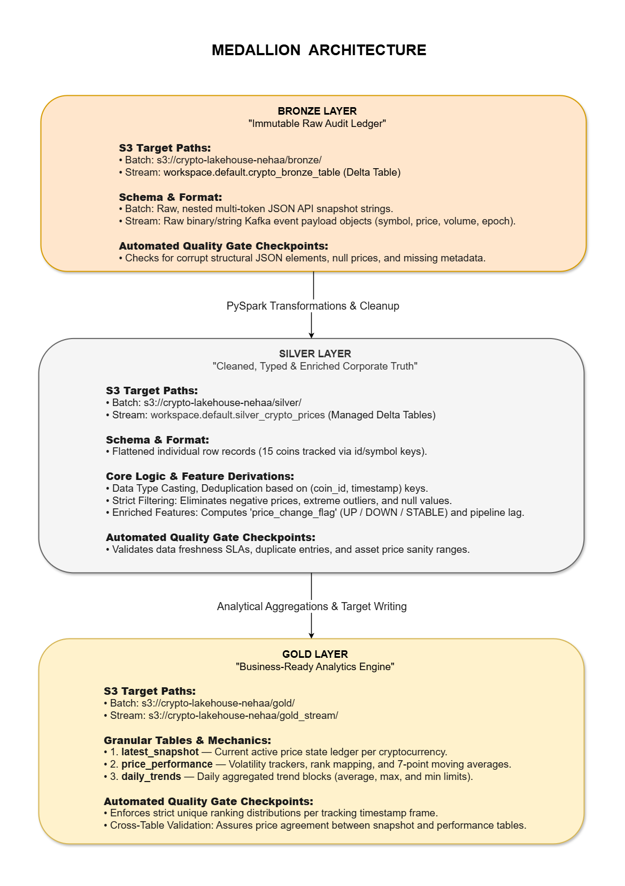
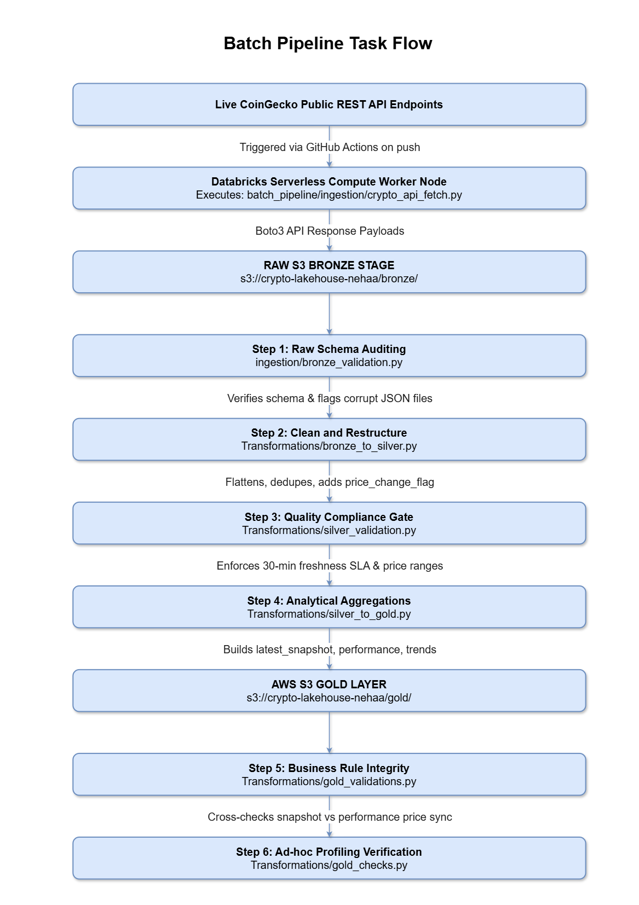
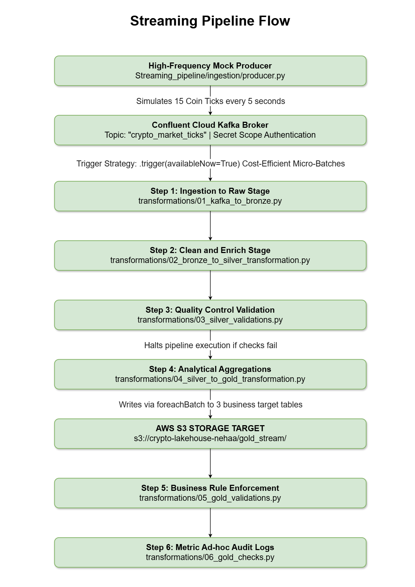
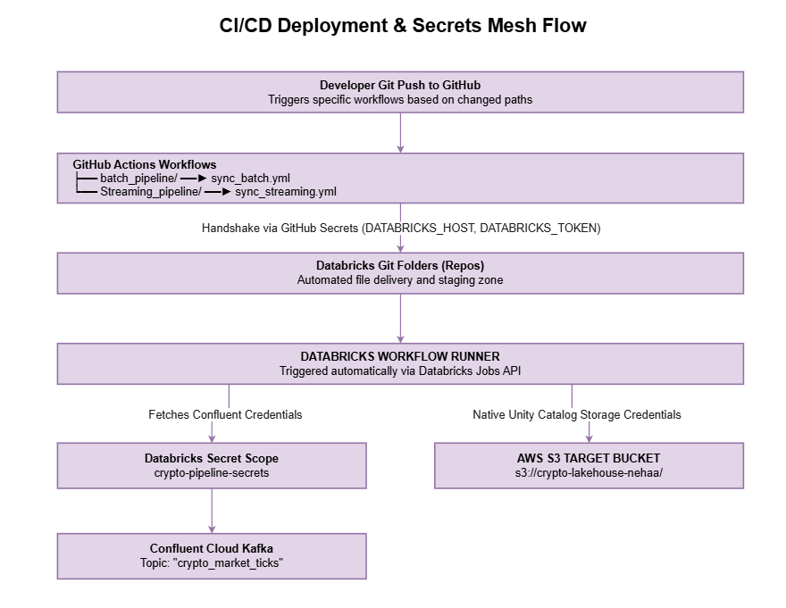

# Crypto Data Lakehouse Pipeline

An end-to-end data lakehouse project implementing both **Batch** and **Near Real-Time Streaming** pipelines to ingest, transform, validate, and analyze cryptocurrency market data.

The project follows the **Medallion Architecture (Bronze → Silver → Gold)** on Databricks, with data stored as Delta tables in AWS S3 and managed via Unity Catalog. It tracks 15 major cryptocurrencies — including Bitcoin, Ethereum, Solana, and Ripple — across two ingestion modes: on-demand batch snapshots from the CoinGecko API and simulated near real-time ticks via Confluent Cloud Kafka.

<br>

## Architecture Overview

Both pipelines share the same cloud storage layer and medallion design, but differ in how data enters the system.

```
[ Batch ]     CoinGecko API  →  Databricks Workflow  →  S3 Bronze (JSON)  →  Silver (Delta)  →  Gold (Delta)
[ Streaming ] Producer (sim) →  Confluent Kafka      →  Bronze (Delta)    →  Silver (Delta)  →  Gold (Delta)
```

Both triggered via GitHub Actions on push to main → Databricks Git sync → Databricks Workflow execution.

<br>

### Overall System Layout



<br>

### Medallion Data Boundaries



<br>
<br>

## Project Structure

```
Crypto-Data-Lakehouse-Pipeline/
├── .github/workflows/
│   ├── sync_batch.yml               # triggers on push to main — syncs batch pipeline and runs Databricks job
│   └── sync_streaming.yml           # triggers on push to main — syncs streaming pipeline and runs Databricks job
├── batch_pipeline/                  # batch ETL engine — CoinGecko API → S3 Delta tables
│   ├── ingestion/                   # API fetch and bronze validation
│   ├── Transformations/             # bronze→silver→gold transformations and quality checks
│   └── README.md                    # batch pipeline setup and run guide
├── streaming_pipeline/              # near real-time engine — Kafka → Spark Structured Streaming → S3
│   ├── ingestion/                   # simulated producer and Kafka config
│   ├── transformations/             # micro-batch transformations and gold aggregations
│   └── README.md                    # streaming pipeline setup and run guide
├── docs/
│   ├── architecture/                # all architecture and flow diagrams
│   ├── data_catalog.md              # Delta table definitions, paths, and update strategies
│   └── data_dictionary.md           # field-level definitions across both pipelines
└── requirements.txt
```

<br>
<br>

## Pipeline Mechanics

### Batch Pipeline

**Ingestion:** Fetches structured JSON snapshots from the CoinGecko public API (`crypto_api_fetch.py`). Raw JSON is written directly to `s3://crypto-lakehouse-nehaa/bronze/` — one timestamped file per run, stored as-is for traceability.

**Processing:** A 7-task sequential Databricks Workflow handles bronze validation → silver transformation → silver validation → gold aggregation → gold validation → gold checks.

**Orchestration:** Triggered by GitHub Actions on any push to `main`. GitHub Actions syncs code to Databricks Git folder and fires the workflow via the Databricks Jobs API.



<br>

### Streaming Pipeline

**Ingestion:** A custom producer (`producer.py`) simulates live price ticks for 15 coins — prices are randomised within ±1% of CoinGecko-sourced baseline values, published to Confluent Cloud Kafka topic `crypto_market_ticks` every 5 seconds, running for a fixed duration before stopping.

**Processing:** Spark Structured Streaming jobs consume available Kafka messages and process them through bronze → silver → gold using `trigger(availableNow=True)` — this processes all currently available data and then stops, giving the cost efficiency of batch execution while using the streaming engine's state management and checkpointing capabilities.

**Orchestration:** Same GitHub Actions → Databricks Git sync → Jobs API pattern as batch. Producer runs as the first task in the Databricks Workflow, followed by the 6 transformation tasks.



<br>
<br>

## Medallion Design

| Layer | Batch | Streaming |
|---|---|---|
| **Bronze** | Raw JSON files in S3 (`s3://crypto-lakehouse-nehaa/bronze/`). One file per run, no transformation applied. | Raw Kafka ticks written to Delta table `workspace.default.crypto_bronze_table` via Structured Streaming. |
| **Silver** | Flattened, type-cast, deduplicated on `(coin_id, event_timestamp)`. Adds `price_change_flag` (UP / DOWN / STABLE) via lag window. Partitioned by `date` at `s3://crypto-lakehouse-nehaa/silver/`. | Same flattening and casting logic. Bitcoin price sanity check applied. No `price_change_flag` — not computed in streaming. Written to managed Delta table `workspace.default.silver_crypto_prices`. |
| **Gold** | Three tables written via overwrite/append modes, partitioned by `date`. Stored at `s3://crypto-lakehouse-nehaa/gold/`. | Three tables written via `foreachBatch` on each micro-batch. Stored at `s3://crypto-lakehouse-nehaa/gold_stream/`. |

**Gold tables (both pipelines):**
- `latest_snapshot` — most recent price per coin, overwritten every run
- `price_performance` — 7-row rolling average, volatility (std dev), and market cap rank per coin per timestamp
- `daily_trends` — daily average, max, min price and volume per coin

<br>
<br>

## Data Quality

Every layer has a dedicated validation step. Data cannot move forward if a critical check fails.

**Bronze validation** checks for corrupt JSON records, missing expected coin columns, null prices, and missing ingestion metadata timestamps.

**Silver validation** runs 8 checks — null prices, duplicate records, valid price change flags (batch), data freshness against a 30-minute SLA (batch), row counts per coin, Bitcoin price sanity range ($10k–$250k), sudden price jumps over 20%, and negative ingestion delay (clock sync issues).

**Gold validation** checks that market cap ranks are unique per timestamp, moving averages have no nulls, and that the snapshot and performance tables agree on Bitcoin's price within a small tolerance.

<br>
<br>

## CI/CD & Secrets

### Deployment Flow

Both GitHub Actions workflows trigger on any push to `main`. They sync pipeline code to a Databricks Git folder and trigger the corresponding Databricks Workflow job via the Jobs API.

```
git push → GitHub Actions → Databricks Git folder sync → Jobs API → Databricks Workflow runs
```



### Credential Management

No credentials are hardcoded anywhere in the pipeline.

- **GitHub → Databricks:** `DATABRICKS_HOST` and `DATABRICKS_TOKEN` stored as GitHub Secrets
- **Databricks → Confluent Cloud Kafka:** API key and secret stored in Databricks secrets scope `crypto-pipeline-secrets`, fetched at runtime via `dbutils.secrets.get()`
- **Databricks → AWS S3:** Managed via Databricks Unity Catalog cloud connection and secrets scope — no explicit key injection in transformation code

<br>
<br>

## Tech Stack

| Tool | Role |
|---|---|
| Python | Ingestion scripts, producer simulation, transformation logic |
| PySpark / Spark SQL | All transformations, window functions, streaming engine |
| Spark Structured Streaming | Near real-time bronze → silver → gold processing |
| Apache Kafka (Confluent Cloud) | Message broker for streaming pipeline |
| Delta Lake | Storage format for all Silver and Gold tables |
| AWS S3 | Physical storage for all pipeline outputs |
| Databricks Workflows | Pipeline orchestration and task dependency management |
| Databricks Unity Catalog | Table registration, governance, and secrets management |
| GitHub Actions | CI/CD — code sync and workflow triggering on push |
| CoinGecko API | Live crypto price data source for batch pipeline |

<br>
<br>

## Documentation

| Document | Description |
|---|---|
| [Batch Pipeline README](./batch_pipeline/README.md) | Batch pipeline setup, run guide, screenshots, and file-level explanations |
| [Streaming Pipeline README](./streaming_pipeline/README.md) | Streaming pipeline setup, run guide, architecture notes, and sample outputs |
| [Data Catalog](./docs/data_catalog.md) | All Delta table definitions, S3 paths, update strategies, and infrastructure reference |
| [Data Dictionary](./docs/data_dictionary.md) | Field-level definitions, types, derivation logic, and technical term glossary |