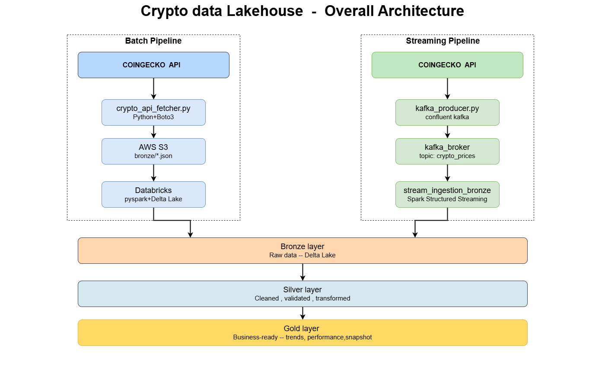
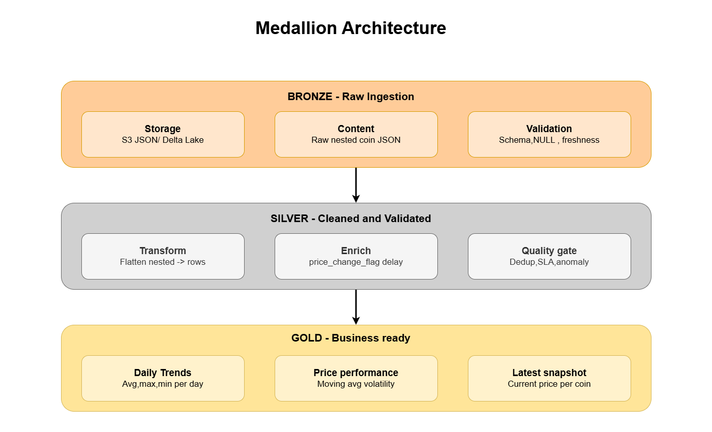
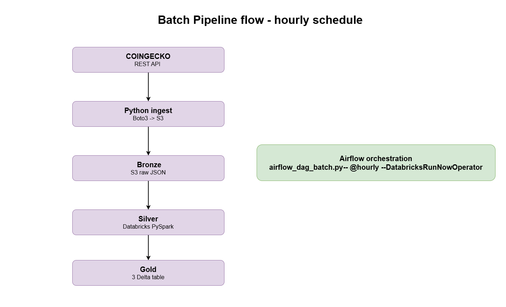
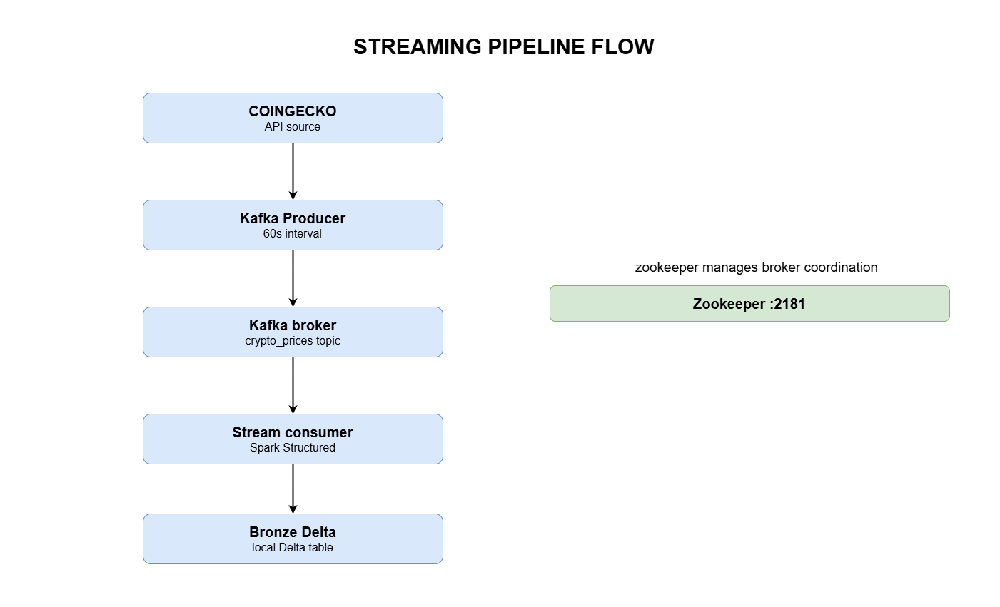

# Crypto Data Lakehouse Pipeline

An end-to-end data lakehouse project implementing both **Batch** and **Near Real-Time Streaming** pipelines to ingest, transform, validate, and analyze cryptocurrency market data. 

The project follows the **Medallion Architecture (Bronze → Silver → Gold)** on Databricks with data stored as Delta tables in AWS S3 and managed via Unity Catalog Volumes. It tracks 15 major cryptocurrencies (including Bitcoin, Ethereum, Solana, and Ripple) across two ingestion modes: hourly batch snapshots from the CoinGecko API and high-frequency live ticks via Kafka.

<br>

## Architecture Overview

This lakehouse unifies two distinct processing paradigms under a single cloud storage and governance layer:

```
[ Batch Ingestion ] ----> CoinGecko API ----> Databricks Job (Hourly) ---\
                                                                          +--> [ Medallion Layers ] --> AWS S3 (Delta Lake)
[ Streaming Ingestion ] -> Kafka Producer -> Confluent Cloud Kafka ------/     (Bronze -> Silver -> Gold)
```

### Overall System Layout


### Medallion Data Boundaries


<br>
<br>

## Project Structure

The repository isolates the two independent processing pipelines while sharing unified system documentation and data definitions:

```
Crypto-Data-Lakehouse-Pipeline/
├── .github/workflows/
│   ├── sync_batch.yml               # CI/CD workflow for the batch pipeline
│   └── sync_streaming.yml           # CI/CD workflow for the streaming pipeline
├── batch_pipeline/                  # Hourly batch ETL engine (CoinGecko API -> S3)
│   ├── ingestion/                   # API consumers and raw schema validation
│   ├── Transformations/             # Medallion processing and data quality checks
│   └── README.md                    # Detailed batch deployment guide
├── streaming_pipeline/              # Near real-time engine (Kafka -> Structured Streaming)
│   ├── ingestion/                   # Event simulation and Kafka producers
│   ├── transformations/             # Micro-batch transformations and lag checks
│   └── README.md                    # Detailed streaming deployment guide
├── docs/                            # Unified project documentation
│   ├── architecture/                # System, batch, streaming, and Airflow DAG diagrams
│   ├── data_catalog.md              # Target Delta table definitions and locations
│   └── data_dictionary.md           # Column types, constraints, and descriptions
└── requirements.txt                 # Shared Python dependencies
```

<br>
<br>

## Pipeline Mechanics & Data Flows

### 1. Batch Pipeline (`/batch_pipeline`)
* **Ingestion:** Fetches structured JSON snapshots from the CoinGecko API at regular intervals (`crypto_api_fetch.py`).
* **Processing Flow:** Data paths move sequentially from raw JSON captures down to structured analytical representations.
* **Orchestration:** Scheduled via Databricks Workflows, running a 7-task linear dependency chain.



### 2. Streaming Pipeline (`/streaming_pipeline`)
* **Ingestion:** A custom mock producer simulates real-time price changes within a $\pm1\%$ variance baseline and streams records to Confluent Cloud Kafka topics at 5-second intervals.
* **Processing Flow:** Structured Streaming jobs process available records using micro-batches.
* **Execution Strategy:** Configured with PySpark's `.trigger(availableNow=True)` setting. This provides the architectural benefits of streaming (state management, checkpointing, event-time processing) with the cost efficiency of batch execution profiles.



<br>
<br>

## Core Medallion Design

Both pipelines isolate data transformation phases to guarantee a clean balance between raw auditability and optimized analytical performance:

| Layer | Implementation Details | Purpose |
| :--- | :--- | :--- |
| **Bronze** | Raw data formats (Unflattened API JSON or raw Kafka payloads). | Permanent, immutable audit trail of every source record. |
| **Silver** | Cleaned, deduplicated on `(coin_id, timestamp)`, type-cast, and enhanced with derived features like `price_change_flag` (UP / DOWN / STABLE). | Clean corporate data truth for general-purpose querying. |
| **Gold** | Processed via `MERGE INTO` or `foreachBatch` into three analytical targets:<br>• `latest_snapshot`: Absolute current price per coin.<br>• `price_performance`: Volatility tracking and a 7-point moving average.<br>• `daily_trends`: Aggregated high, low, and average values. | Power-user analytics and operational dashboards. |

<br>
<br>

## Data Quality, Testing & Governance

Data cannot progress to downstream layers unless it passes strict, automated validation thresholds executed as dedicated notebook stages within your Databricks workflows:

* **Ingestion Audits:** Validates data structures against rigid schema definitions, catches corrupt payloads, and tracks ingestion lag metrics.
* **Data Sanity Checks:** Ensures structural parameters are met (e.g., verifying that Bitcoin ranges track reasonably, checking that market cap rankings contain no duplicate positions per timestamp, and asserting that moving averages yield no `null` fields).
* **Cross-Table Verification:** Confirms that individual analytical targets (like a snapshot view vs. a long-term performance table) stay completely synchronized during state transitions.

<br>
<br>

## CI/CD Deployment Sync

Code distribution handles deployment seamlessly across environments without continuous manual file staging via dedicated GitHub Actions workflows:

```
Developer Push → GitHub Repository → GitHub Actions Workflow → Databricks Git Volumes Sync → Jobs API Trigger
```

* **`sync_batch.yml`:** Catches any code modifications made inside the `/batch_pipeline` directory. It handles the authorization handshake with your Databricks workspace using stored GitHub Secrets (Host URL and Personal Access Token) to sync the latest assets directly into a Databricks Git folder. Once staged, it hits the Databricks Jobs API to trigger the batch pipeline.
* **`sync_streaming.yml`:** Monitors alterations inside the `/streaming_pipeline` directory. It utilizes the same tokenized authorization flow to update the streaming source files and automatically run the chained streaming tasks.

<br>
<br>

## Infrastructure Connections & Secret Handshakes

To eliminate hardcoded credentials completely, the lakehouse relies on a secure cloud handshake mesh across all moving parts:

* **Kafka Connection Handshake:** The real-time streaming workers read configurations from a gitignored `client.properties` setup locally. When running on Databricks, the authentication details are securely pulled out of the `crypto-pipeline-secrets` secret scope to connect to Confluent Cloud Kafka topics.
* **AWS S3 Storage Handshake:** Access to target S3 storage buckets is authenticated natively via structured Unity Catalog storage connections and cloud credentials configured in Databricks, fallback-supported by local environment variables for isolated testing.
* **Compute Profiles:** Pipelines are lightweight and fully optimized to execute entirely over cost-efficient, temporary serverless compute setups or single-node clusters on the Databricks Free / Community Tier ecosystem.

---

### Deep Dives
For specific implementation code, execution run screenshots, or setup rules, check out the dedicated readmes inside the **[Batch Pipeline](./batch_pipeline/README.md)** and **[Streaming Pipeline](./streaming_pipeline/README.md)** directories.
