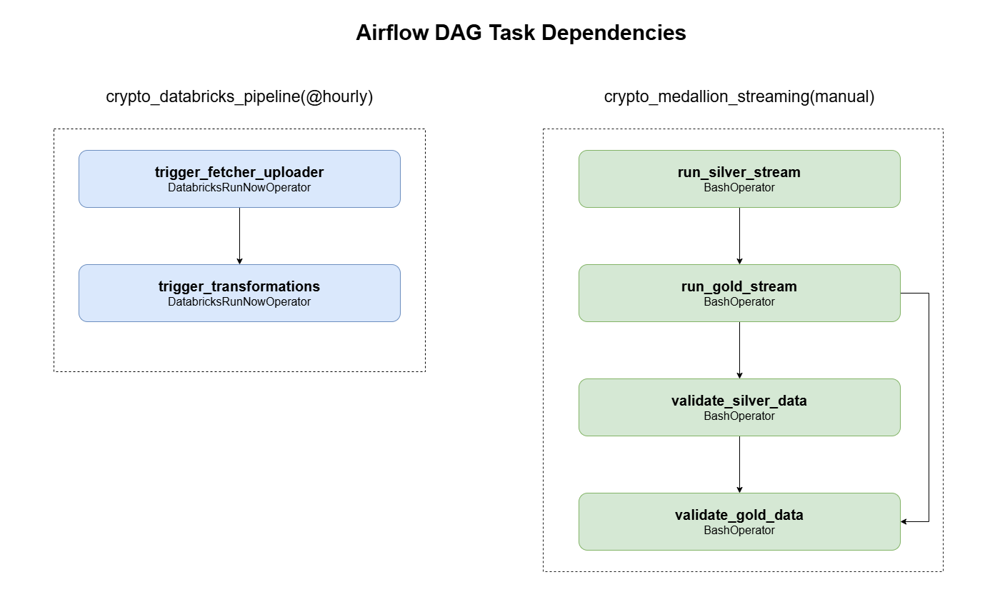

# Crypto Data Lakehouse Pipeline

A end-to-end data engineering project that ingests real-time cryptocurrency market data for **Bitcoin, Ethereum, and Solana** through two parallel pipelines — batch and streaming — and stores it in a Medallion Architecture (Bronze → Silver → Gold) using Delta Lake, Apache Kafka, Apache Spark, Databricks, and AWS S3.

---

## Project Summary

| Property | Details |
|---|---|
| **Coins tracked** | Bitcoin, Ethereum, Solana |
| **Data source** | CoinGecko public API |
| **Batch schedule** | Hourly |
| **Streaming interval** | Every 60 seconds |
| **Architecture** | Medallion (Bronze / Silver / Gold) |
| **Orchestration** | Apache Airflow (Astronomer Astro) |
| **Processing** | PySpark + Spark Structured Streaming |
| **Storage** | AWS S3 + Delta Lake |
| **Batch compute** | Databricks |
| **Message broker** | Apache Kafka + Zookeeper |

---

## Architecture


The project runs two independent pipelines that share the same Medallion layer design:

- **Batch pipeline** — fetches data hourly via Python, stores raw JSON on S3, transforms through Bronze → Silver → Gold on Databricks using PySpark
- **Streaming pipeline** — continuously produces Kafka messages every 60 seconds, consumed by Spark Structured Streaming jobs that write to local Bronze Delta and S3 Silver/Gold Delta tables

Both pipelines are orchestrated by Apache Airflow DAGs running on Astronomer.

---

## Tech Stack

| Layer | Technology |
|---|---|
| Data source | CoinGecko REST API |
| Ingestion (batch) | Python, Boto3 |
| Ingestion (streaming) | Confluent Kafka, kafka-python |
| Message broker | Apache Kafka, Zookeeper |
| Stream processing | Apache Spark Structured Streaming |
| Batch processing | Databricks, PySpark |
| Table format | Delta Lake |
| Storage | AWS S3 |
| Orchestration | Apache Airflow, Astronomer Astro CLI |
| Runtime | Docker, Astro Runtime 11.3.0 |
| Language | Python 3.8+ |

---

## Medallion Architecture


### Bronze — Raw data
Stores data exactly as received from the source. No transformations applied.

- Batch: timestamped JSON files on S3 at `s3://crypto-lakehouse-neha/bronze/`
- Streaming: nested Delta table at `data/bronze/crypto_prices_delta`

### Silver — Cleaned and validated
Flattens nested coin objects into structured rows, adds derived fields, enforces quality rules.

- One row per coin per ingestion event
- Fields: `coin_id`, `price_usd`, `market_cap`, `volume_24h`, `event_timestamp`, `price_change_flag`, `ingestion_delay_seconds`
- Batch: Databricks Unity Catalog table `workspace.default.silver_crypto_prices`
- Streaming: S3 Delta table `s3a://crypto-lakehouse-neha/silver/crypto_prices_clean`

### Gold — Business ready
Produces three analytics-ready aggregation tables from Silver data.

| Table | Description |
|---|---|
| `gold_latest_snapshot` | Most recent price per coin — always 3 rows |
| `gold_price_performance` | Moving average, volatility, market cap rank |
| `gold_daily_trends` | Daily avg, max, min price and volume per coin |

---

## Repository Structure

```
Crypto-Data-lakehouse-pipeline/
│
├── batch_pipeline/                        # Hourly batch pipeline
│   ├── ingestion/
│   │   └── crypto_api_fetch.py            # Fetches API data, uploads to S3
│   ├── medallion/
│   │   ├── bronze/
│   │   │   └── bronze_ingestion_notes.py  # Bronze runs inside Databricks session
│   │   ├── silver/
│   │   │   ├── silver_transformations.py  # Bronze → Silver on Databricks
│   │   │   └── silver_validation.py       # Silver quality gate
│   │   └── gold/
│   │       ├── gold_transformations.py    # Silver → Gold on Databricks
│   │       ├── gold_checks.py             # SQL inspection queries
│   │       └── gold_validations.py        # Gold business logic validation
│   └── README.md
│
├── streaming_pipeline/                    # Real-time streaming pipeline (Astro project)
│   ├── .astro/                            # Astro CLI configuration
│   ├── dags/
│   │   └── airflow_dag_streaming.py       # Streaming orchestration DAG
│   ├── include/
│   │   └── medallion/
│   │       ├── silver/
│   │       │   ├── silver_transformations.py
│   │       │   └── silver_validation.py
│   │       └── gold/
│   │           ├── gold_transformations.py
│   │           ├── gold_checks.py
│   │           └── gold_validations.py
│   ├── ingestion/
│   │   ├── kafka_producer.py              # Publishes to Kafka every 60s
│   │   └── Stream_Ingestion_Bronze.py     # Spark consumer → Bronze Delta
│   ├── Dockerfile
│   ├── requirements.txt
│   └── README.md
│
├── dags/                                  # Root Airflow DAGs (batch)
│   └── airflow_dag_batch.py               # Batch orchestration DAG
│
├── config/
│   └── config_template.py                 # Configuration template
│
├── data/
│   └── bronze/
│       └── crypto_prices_delta/           # Local Bronze Delta output
│
├── docs/
│   ├── architecture/                      # Architecture diagrams (PNG)
│   │   ├── 01_overall_architecture.png
│   │   ├── 02_medallion_layers.png
│   │   ├── 03_streaming_flow.png
│   │   ├── 04_batch_flow.png
│   │   └── 05_airflow_dag.png
│   ├── data_catalog.md                    # All tables, locations, schemas
│   └── data_dictionary.md                 # All field definitions and terms
│
├── tests/
│   ├── batch/
│   ├── streaming/
│   └── dags/
│       └── test_dag_example.py
│
├── plugins/                               # Airflow plugins (root)
├── .astro/                                # Root Astro CLI config
├── .dockerignore
├── .env                                   # Local environment variables (not committed)
├── .gitignore
├── airflow_settings.yaml
├── docker-compose.yaml                    # Kafka + Zookeeper services
├── Dockerfile                             # Astro Runtime 11.3.0 + Java 11
├── packages.txt
└── requirements.txt
```

---

## Pipeline Flows

### Batch pipeline


```
CoinGecko API
    → crypto_api_fetch.py  (Python + Boto3)
    → S3 Bronze JSON
    → Databricks Silver transformation
    → Databricks Gold aggregations
    → Airflow DAG triggers jobs hourly (DatabricksRunNowOperator)
```

### Streaming pipeline


```
CoinGecko API
    → kafka_producer.py  (every 60 seconds)
    → Kafka broker (port 9092)
    → Stream_Ingestion_Bronze.py  (Spark Structured Streaming)
    → Bronze Delta (local)
    → silver_transformations.py  (S3)
    → gold_transformations.py    (S3 — 3 tables)
    → Airflow DAG manages execution and validation
```

### Airflow DAG dependencies



**Batch DAG** (`crypto_databricks_pipeline` — `@hourly`):
```
trigger_fetcher_uploader >> trigger_transformations
```

**Streaming DAG** (`crypto_medallion_streaming` — manual trigger):
```
run_silver_stream >> validate_silver_data
run_gold_stream   >> validate_gold_data
```

---

## Setup and Running

### Prerequisites

- Python 3.8+
- Docker Desktop
- Astro CLI
- Java JDK 11 (Amazon Corretto recommended)
- AWS account with S3 bucket
- Databricks workspace with Unity Catalog

### Install Astro CLI

```bash
# Windows
winget install -e --id Astronomer.Astro

# Mac
brew install astro
```

### Environment variables

Create a `.env` file in the project root:

```env
# Airflow
AIRFLOW_UID=50000
FERNET_KEY=your_generated_fernet_key
_AIRFLOW_WWW_USER_USERNAME=airflow
_AIRFLOW_WWW_USER_PASSWORD=airflow

# AWS
AWS_ACCESS_KEY_ID=your_key
AWS_SECRET_ACCESS_KEY=your_secret
AWS_REGION=us-east-1
S3_BUCKET_NAME=your-bucket-name

# Kafka
KAFKA_BROKER=localhost:9092
KAFKA_TOPIC=crypto_prices

# Java
JAVA_HOME=C:/Program Files/Amazon Corretto/jdk11.0.30_7
HADOOP_HOME=C:/hadoop
```

Generate a Fernet key:
```bash
python -c "from cryptography.fernet import Fernet; print(Fernet.generate_key().decode())"
```

### Running the batch pipeline

```bash
# Install dependencies
pip install -r requirements.txt

# Start Airflow
astro dev start

# Open UI at http://localhost:8080 and enable: crypto_databricks_pipeline
```

### Running the streaming pipeline

```bash
# Step 1 — Start Kafka and Zookeeper
docker-compose up zookeeper kafka -d

# Step 2 — Start Airflow inside streaming_pipeline folder
cd streaming_pipeline
astro dev start

# Step 3 — Start the Kafka producer (separate terminal)
python ingestion/kafka_producer.py

# Step 4 — Start the Bronze consumer (separate terminal)
python ingestion/Stream_Ingestion_Bronze.py

# Step 5 — Trigger streaming DAG manually at http://localhost:8080
```

---

## Data Quality

Each medallion layer has a dedicated validation script that acts as a quality gate before data is promoted to the next layer.

| Layer | Pipeline | File | Key checks |
|---|---|---|---|
| Bronze | Batch | `bronze_ingestion_notes.py` | JSON integrity, schema contract, NULL prices, freshness |
| Silver | Batch | `silver_validation.py` | Duplicates, NULL prices, SLA, anomaly detection, price stability |
| Gold | Batch | `gold_validations.py` | Ranking integrity, moving averages, cross-table sync |
| Silver | Streaming | `silver_validation.py` | Coin coverage, freshness, volume, anomaly detection |
| Gold | Streaming | `gold_validations.py` | Snapshot freshness, windowing integrity, analytics completeness |

---

## Documentation

| Document | Description |
|---|---|
| [`docs/data_catalog.md`](docs/data_catalog.md) | All tables across both pipelines — locations, formats, schemas, write modes |
| [`docs/data_dictionary.md`](docs/data_dictionary.md) | Every field defined — source, derived, flags, aggregations, technical terms |
| [`batch_pipeline/README.md`](batch_pipeline/README.md) | Batch pipeline setup, schema, and quality gates |
| [`streaming_pipeline/README.md`](streaming_pipeline/README.md) | Streaming pipeline setup, Kafka config, and DAG details |

---

## Project Status

| Component | Status |
|---|---|
| Batch ingestion — CoinGecko → S3 | Complete |
| Batch Bronze Delta layer | Complete |
| Batch Silver — Databricks | Complete |
| Batch Gold — 3 Delta tables | Complete |
| Batch Airflow DAG | Complete |
| Streaming Kafka producer | Complete |
| Streaming Bronze Delta | Complete |
| Streaming Silver — S3 | Complete |
| Streaming Gold — 3 Delta tables | Complete |
| Streaming Airflow DAG | Complete |
| Data quality gates (all layers) | Complete |
| Documentation | Complete |

---

## Key Concepts Demonstrated

- **Medallion Architecture** — progressive data refinement through Bronze, Silver, Gold layers
- **Lambda Architecture** — parallel batch and streaming pipelines producing the same output
- **Spark Structured Streaming** — continuous stream processing with watermarks and windowed aggregations
- **Delta Lake** — ACID-compliant table format with schema enforcement and time travel
- **Apache Kafka** — distributed event streaming with producer/consumer decoupling
- **Airflow Orchestration** — DAG-based scheduling with task dependencies and retry logic
- **Data Quality Engineering** — validation gates at every layer with integrity, freshness, and anomaly checks
- **Cloud Storage** — partitioned Delta tables on AWS S3 for scalable data lake storage

---

*Built with Python, PySpark, Delta Lake, Apache Kafka, Apache Airflow, Databricks and AWS S3.*
