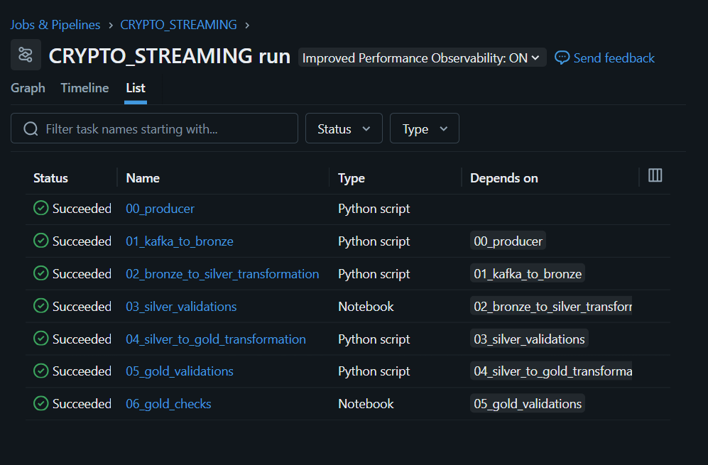
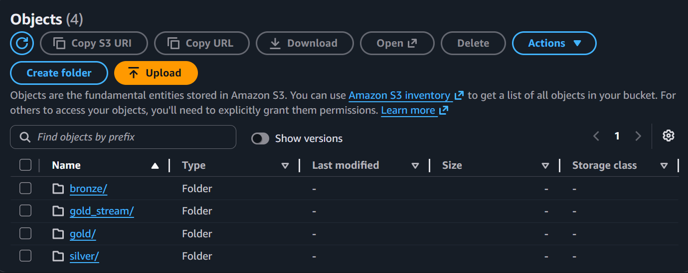
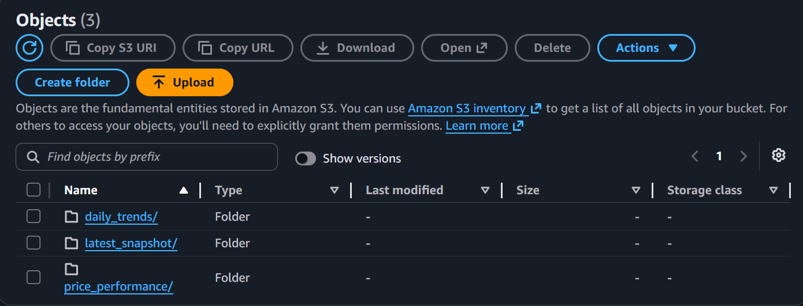
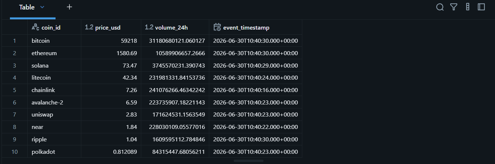
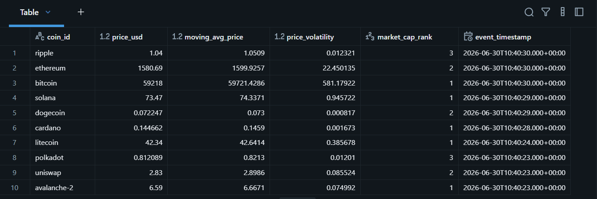
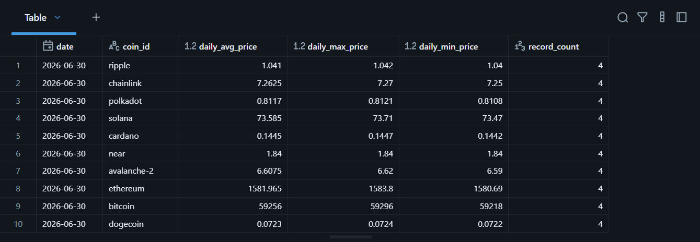

# Crypto Data Lakehouse — Streaming Pipeline

A real-time streaming pipeline that simulates live crypto ticks and runs them through a Bronze → Silver → Gold medallion architecture on Databricks Structured Streaming, with data stored in AWS S3 as Delta tables.

Tracks 15 cryptocurrencies including Bitcoin, Ethereum, Solana, and Ripple — producing price and volume ticks at 5-second intervals via Kafka.

<br>

## Architecture

```
Producer (producer.py)
      |
      v
Confluent Cloud Kafka (crypto_market_ticks topic)
      |
      v
01_Kafka_To_Bronze (01_kafka_to_bronze.py)
      |
      v
02_Bronze_To_Silver (02_bronze_to_silver_transformation.py)
      |
      v
03_Silver_Validations (03_silver_validations.py)
      |
      v
04_Silver_To_Gold (04_silver_to_gold_transformation.py)
      |
      v
05_Gold_Validations (05_gold_validations.py)
      |
      v
06_Gold_Checks (06_gold_checks.py)
```

Each layer writes to its own path in S3 as Delta tables, registered in the Databricks Unity Catalog.

<br>

## How It Runs

Code is pushed to GitHub, which triggers a GitHub Actions workflow (`sync.yml`). This workflow syncs the latest code to a Databricks Git folder and then triggers a Databricks Workflow job via the Jobs API. The actual 7-task pipeline runs entirely inside Databricks as a chained streaming job, with each task depending on the one before it.

```
git push → GitHub Actions → sync code to Databricks → trigger Databricks Workflow → pipeline runs
```

The run history below shows the full job — all 7 tasks succeeded.

<br>



<br>
<br>

## Project Structure

```
Streaming_pipeline/
├── ingestion/
│   ├── client.properties          # local Kafka client config (gitignored)
│   ├── client.properties.example  # template for client.properties
│   └── producer.py                # simulates ticks, publishes to Kafka
├── screenshots/
└── transformations/
    ├── 01_kafka_to_bronze.py             # reads Kafka stream, writes raw to bronze
    ├── 02_bronze_to_silver_transformation.py  # validates, types, dedupes, writes silver
    ├── 03_silver_validations.py          # checks nulls, outliers, ingestion delay
    ├── 04_silver_to_gold_transformation.py    # builds 3 gold tables for analytics
    ├── 05_gold_validations.py            # checks ranking integrity and cross-table sync
    └── 06_gold_checks.py                 # SQL queries to manually verify gold tables
```

<br>
<br>

## What Each Layer Does

**Bronze** — raw ticks straight off the Kafka topic, parsed against a fixed schema (symbol, price, volume, timestamp) and stored as-is for traceability.

<br>

**Silver** — cleaned and structured. Records are filtered for nulls, negative prices, and Bitcoin sanity bounds, then cast to proper types. Event timestamp, date, and hour are derived from the raw epoch timestamp, duplicates are removed on `(coin_id, timestamp)`, and ingestion delay is computed to track pipeline latency.

<br>

**Gold** — three tables built for different use cases, written via `foreachBatch` on every micro-batch:
- `gold_stream_latest_snapshot` — most recent price per coin
- `gold_stream_price_performance` — 7-tick moving average, volatility, and market cap rank per coin per timestamp
- `gold_stream_daily_trends` — daily average, max, and min price and volume per coin

<br>
<br>

## Data Quality Checks

Every layer has its own validation step before data moves forward:

<br>

**Silver validation** checks for null or corrupt prices, null symbols, and inspects max/average ingestion delay per coin to catch pipeline lag.

<br>

**Gold validation** checks that market cap ranks are unique per timestamp, that moving averages have no nulls, and that the latest snapshot table and the price performance table agree on Bitcoin's price within a small tolerance — flagging any sync latency between the two.

<br>

If a check fails, the validation step prints a clear pass/fail result so issues surface immediately rather than flowing downstream silently.

<br>
<br>

## Authentication & Secrets

GitHub connects to Databricks using a host URL and access token stored as GitHub Secrets. The pipeline connects to Confluent Cloud Kafka using credentials stored in a Databricks secrets scope (`crypto-pipeline-secrets`), with a local `client.properties` file as a fallback for running the producer outside Databricks. Databricks connects to AWS S3 for gold-layer storage using a configured cloud connection. No credentials are ever hardcoded in the pipeline scripts.

<br>
<br>

## Storage on S3

Gold layer data lands in S3 as Delta tables, organized by table:

```
s3://crypto-lakehouse-nehaa/
└── gold_stream/
    ├── latest_snapshot/
    ├── price_performance/
    └── daily_trends/
```

<br>



<br>



<br>
<br>

## Sample Output

**Latest snapshot — live price per coin**

<br>



<br>
<br>

**Price performance — moving average, volatility, and rank**

<br>



<br>
<br>

**Daily trends — average, max, min per coin**

<br>



<br>
<br>

## Tech Stack

Python, PySpark (Structured Streaming, Spark SQL), Confluent Cloud Kafka, Databricks Workflows, Delta Lake, AWS S3, GitHub Actions

<br>
<br>

## Notes

- Each task runs with `trigger(availableNow=True)`, so the streaming job processes all currently available data and then stops, rather than running continuously
- Producer simulates ticks rather than calling a live exchange API directly — prices are randomized within ±1% of CoinGecko-sourced baseline values
- AWS credentials are pulled from the Databricks-S3 cloud connection, with the Databricks secrets scope handling Confluent Cloud credentials
- `display()` calls inside the validation/check notebooks are Databricks-native and won't run outside a Databricks notebook environment