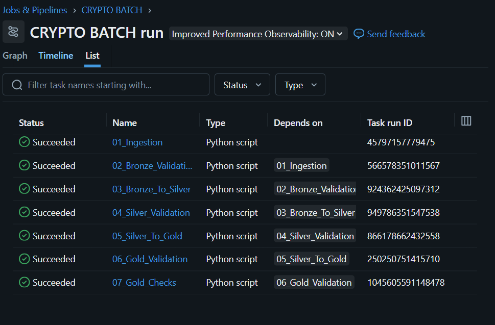
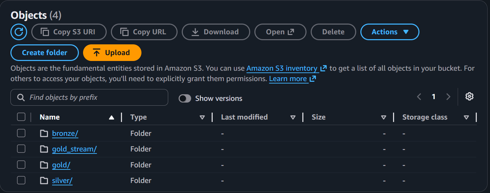
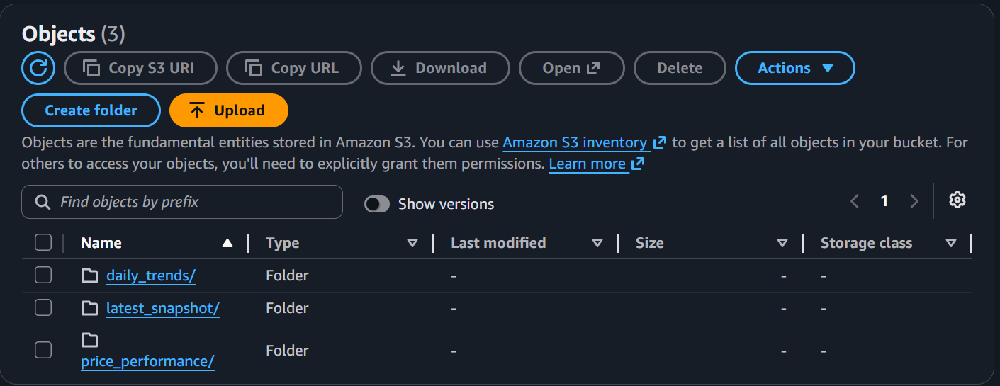
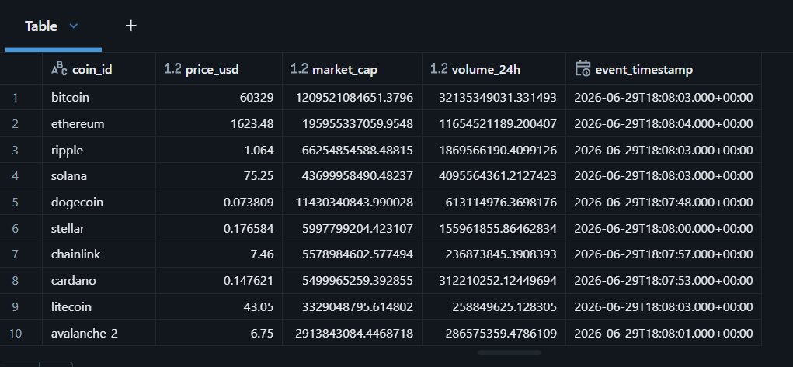
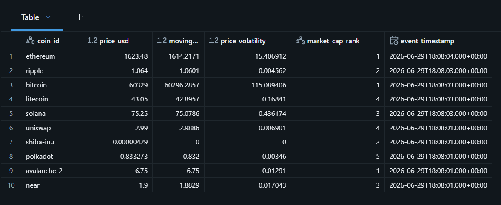
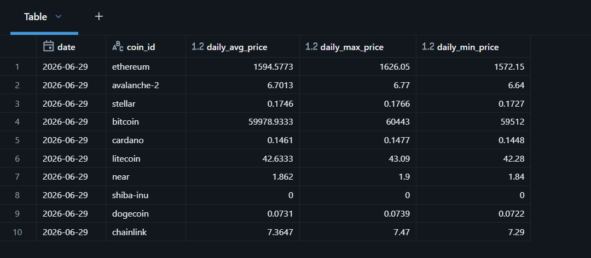

# Crypto Data Lakehouse — Batch Pipeline

A batch ETL pipeline that pulls live crypto prices from the CoinGecko API and runs them through a Bronze → Silver → Gold medallion architecture on Databricks, with data stored in AWS S3 as Delta tables.

Tracks 15 cryptocurrencies including Bitcoin, Ethereum, Solana, and Ripple — fetching price, market cap, and 24h volume at regular intervals.

<br>

## Architecture

```
CoinGecko API
      |
      v
01_Ingestion (crypto_api_fetch.py)
      |
      v
02_Bronze_Validation (bronze_validation.py)
      |
      v
03_Bronze_To_Silver (bronze_to_silver.py)
      |
      v
04_Silver_Validation (silver_validation.py)
      |
      v
05_Silver_To_Gold (silver_to_gold.py)
      |
      v
06_Gold_Validation (gold_validations.py)
      |
      v
07_Gold_Checks (gold_checks.py)
```

Each layer writes to its own path in S3 as Delta tables, registered in the Databricks Unity Catalog.

<br>

## How It Runs

Code is pushed to GitHub, which triggers a GitHub Actions workflow (`sync.yml`). This workflow syncs the latest code to a Databricks Git folder and then triggers a Databricks Workflow job via the Jobs API. The actual 7-step pipeline runs entirely inside Databricks as a scheduled job.

```
git push → GitHub Actions → sync code to Databricks → trigger Databricks Workflow → pipeline runs
```

This run history below shows the full job — all 7 tasks succeeded, with each task depending on the one before it.

<br>



<br>
<br>

## Project Structure

```
batch_pipeline/
├── ingestion/
│   ├── crypto_api_fetch.py       # pulls live prices from CoinGecko, writes raw JSON to bronze
│   └── bronze_validation.py      # checks schema, nulls, and corrupt records in bronze
├── Transformations/
│   ├── bronze_to_silver.py       # flattens raw JSON, casts types, dedupes, adds price change flags
│   ├── silver_validation.py      # checks duplicates, freshness, anomalies, price jumps
│   ├── silver_to_gold.py         # builds 3 gold tables for analytics
│   ├── gold_validations.py       # checks ranking integrity and cross-table consistency
│   └── gold_checks.py            # SQL queries to manually verify gold tables
└── README.md
```

<br>
<br>

## What Each Layer Does

**Bronze** — raw JSON snapshots from CoinGecko, one file per run, stored as-is for traceability.

<br>

**Silver** — cleaned and structured. Nested JSON is flattened into rows, prices are cast to proper types, duplicates are removed using `MERGE INTO`-style logic, and each row gets a `price_change_flag` (UP / DOWN / STABLE) based on the previous price for that coin.

<br>

**Gold** — three tables built for different use cases:
- `gold_latest_snapshot` — most recent price per coin
- `gold_price_performance` — 7-point moving average, volatility, and market cap rank per coin per timestamp
- `gold_daily_trends` — daily average, max, and min price per coin

<br>
<br>

## Data Quality Checks

Every layer has its own validation step before data moves forward:

<br>

**Bronze validation** checks for corrupt JSON, missing expected coins, null prices, and missing ingestion metadata.

<br>

**Silver validation** runs 8 checks — duplicate records, null prices, valid price change flags, partition counts, data freshness against a 30-minute SLA, row counts per coin, Bitcoin price sanity range, sudden price jumps over 20%, and negative ingestion delay (clock sync issues).

<br>

**Gold validation** checks that ranks are unique per timestamp, moving averages have no nulls, and that the snapshot table and performance table agree on price for the same coin.

<br>

If a critical check fails, the pipeline stops rather than letting bad data flow downstream.

<br>
<br>

## Authentication & Secrets

GitHub connects to Databricks using a host URL and access token stored as GitHub Secrets. Databricks connects to AWS S3 using credentials stored in a Databricks secrets scope, with environment variables as a local fallback for testing outside Databricks. No credentials are ever hardcoded in the pipeline scripts.

<br>
<br>

## Storage on S3

Data lands in S3 as Delta tables, organized by layer:

```
s3://crypto-lakehouse-nehaa/
├── bronze/
├── silver/
└── gold/
    ├── latest_snapshot/
    ├── price_performance/
    └── daily_trends/
```

<br>



<br>



<br>
<br>

## Sample Output

**Latest snapshot — top coins by market cap**

<br>



<br>
<br>

**Price performance — moving average and volatility**

<br>



<br>
<br>

**Daily trends — average, max, min per coin**

<br>



<br>
<br>

## Tech Stack

Python, PySpark (Spark SQL), Databricks Workflows, Delta Lake, AWS S3, Boto3, GitHub Actions, CoinGecko API

<br>
<br>

## Notes

- Runs on Databricks Free Edition / Serverless compute
- AWS credentials are pulled from Databricks secrets scope, with a local `.env` fallback for testing outside Databricks
- `display()` calls inside the scripts are Databricks-native and won't run outside a Databricks notebook environment